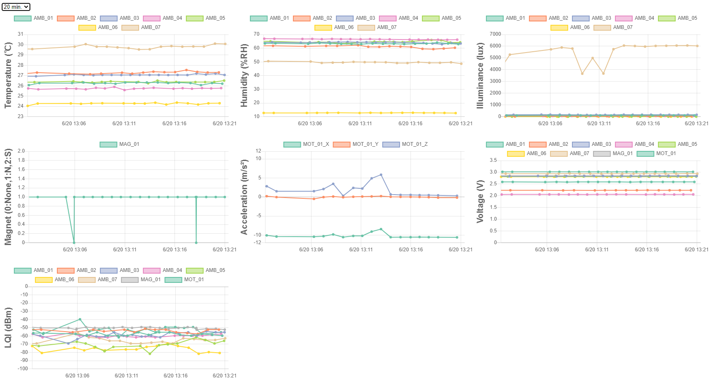

# MQTT bridge for TWELITE PAL
TWELITE PAL (親機) の出力を MQTT に変換します。[環境センサーPAL](https://mono-wireless.com/jp/products/twelite-pal/sense/amb-pal.html)、[動作センサーPAL](https://mono-wireless.com/jp/products/twelite-pal/sense/motion-pal.html)、[開閉センサーPAL](https://mono-wireless.com/jp/products/twelite-pal/sense/openclose-pal.html)に対応しています。サーバーに配置しなくてもセンサ出力を確認できる HTML のビューアーもついています。

## 例
|トピック|メッセージ|
|---|---|
|Temperature|{"Id":"AMB_02","Value":22.85}|
|Humidity|{"Id":"AMB_02","Value":77.38}|
|Illuminance|{"Id":"AMB_02","Value":100}|
|Voltage|{"Id":"AMB_02","Value":2.195}|
|Lqi|{"Id":"AMB_02","Value":-59.7}|
|Magnet|{"Id":"MAG_01","Value":2}|
|Acceleration|{"Id":"MOT_01_X","Value":-10.508}|
|Acceleration|{"Id":"MOT_01_Y","Value":-0.142}|
|Acceleration|{"Id":"MOT_01_Z","Value":0.255}|

- 参考: https://twitter.com/ksasao/status/1271816152935657472




# 準備するもの
TWELITE PAL以外に下記のものが必要です。

- TWELITE PAL [親機のファームウェアを書き込み](https://mono-wireless.com/jp/products/TWE-APPS/App_pal/parent.html)済みの TWELITE DIP
- [M5 ATOM Lite](https://www.switch-science.com/catalog/6262/) (M5 ATOM Matrixも可)
- [ATOM HUB Proto Kit](https://m5stack.com/products/atom-hub-proto-kit) (ケースです。他のもので代用可能。)
- [Mosquitto](https://www.google.com/search?q=Mosquitto+mqtt&ie=&oe=) などの MQTT Broker (MQTT over WebSocket を有効化してください)

# 設定
1. M5 ATOM と TWELITE DIP を下記のように接続します。他のピンはそのままでかまいません。

|M5 ATOM|TWELITE DIP|
|---|---|
|3V3|VCC|
|GND|GND|
|G21|6|

2. Arduino IDE で TWELITE_MQTT.ino を開き、SSID, PASSWORD, MQTT ブローカーのIPアドレスを書き換えて、M5 ATOM に書き込みます。

3. ```viewer/index.html``` をエディタで開き、下記を環境に合わせて変更します。なお、MQTTブローカーは MQTT over WebSocket が使えるように設定しておく必要があります。
```
let mqttBrokerAddress = "192.168.3.40";
let mqttOverWebSocketPort = 8001;
```

4. ```viewer/index.html``` をブラウザで開くと TWELITE PAL からのデータを確認できます。ファイルはサーバーに配置する必要はありません。
